<p align="center">
  
</p>

<h1 align="center">STEALTH BATTLESHIP</h1>

<p align="center"><strong>Trustless Naval Warfare on Stellar</strong></p>

<p align="center">
  <em>Fair by math. Fun by design.</em>
</p>

<p align="center">
  Built for <strong>Stellar Hacks: ZK Gaming 2026</strong>
</p>

---

## Hackathon Requirements Checklist

| # | Requirement | Status | Implementation |
|---|-------------|--------|----------------|
| 1 | **ZK-Powered Mechanic** | ✅ | 3 Noir circuits (`board_validity`, `shot_proof`, `turns_proof`) using Poseidon2 hashing. ZK is the core mechanic — it hides ship positions, proves hit/miss honestly, and computes the winner inside the circuit. Not bolted on. |
| 2 | **Deployed Onchain Component** | ✅ | Soroban contract [`CDL6EX...HMR3`](https://stellar.expert/explorer/testnet/contract/CDL6EX734XCDSTOQE5W3FYD5ZKOHQOIBXZOL4NF5FC66CEHRPIQRHMR3) verifies UltraHonk proofs on-chain. Calls `start_game()` and `end_game()` on the [Game Hub `CB4VZA...EMYG`](https://stellar.expert/explorer/testnet/contract/CB4VZAT2U3UC6XFK3N23SKRF2NDCMP3QHJYMCHHFMZO7MRQO6DQ2EMYG). Backend wallet has [124 operations on testnet](https://stellar.expert/explorer/testnet/account/GDANLGAOCSGXHMSO4PM2L43FB27MB7JBDXKSBV5CMCCEFXE3ISDEM4Z2). |
| 3 | **Front End** | ✅ | Full mobile app (React Native / Expo) + web client. 14 screens with gameplay, animations, haptics, i18n (EN/PT-BR/ES), ranking system, match history. See [Screenshots](#screenshots) below. |
| 4 | **Open-source Repo** | ✅ | [github.com/olivmath/stealth-battleship](https://github.com/olivmath/stealth-battleship) — full source code with clear README. |
| 5 | **Video Demo (2-3 min)** | ✅ | See the [raw demo video](https://github.com/olivmath/stealth-battleship/raw/main/assets/zkbb.mp4). |


---

## The Problem

In digital Battleship, someone always sees both boards. The server knows everything. Traditional approaches all fail: the server can cheat, commit-reveal breaks when the loser disconnects, and on-chain boards leak to mempool front-running.

<p align="center">
  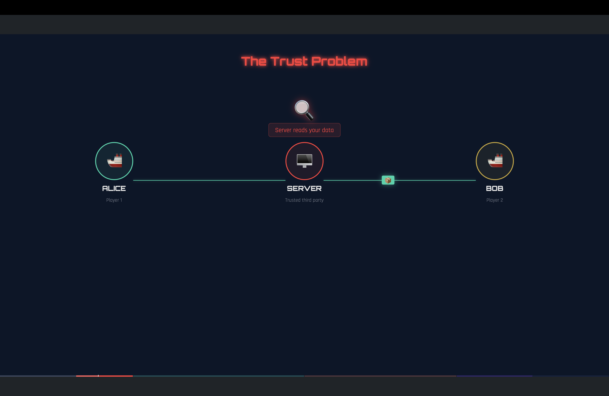
</p>

## ZK Circuits (Noir)

Three specialized circuits guard the entire game lifecycle:

### Proof 1 — Board Validity

Proves your board is legal (correct ship sizes, no overlaps, within bounds) without revealing ship positions. The board is Poseidon2-hashed and committed on-chain.

<p align="center">
  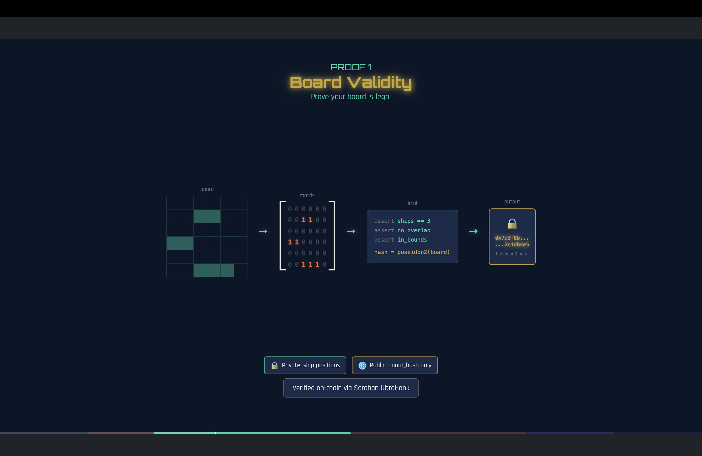
</p>

### Proof 2 — Shot Proof

Every hit or miss is proven against the committed board hash. Lying is mathematically impossible.

<p align="center">
  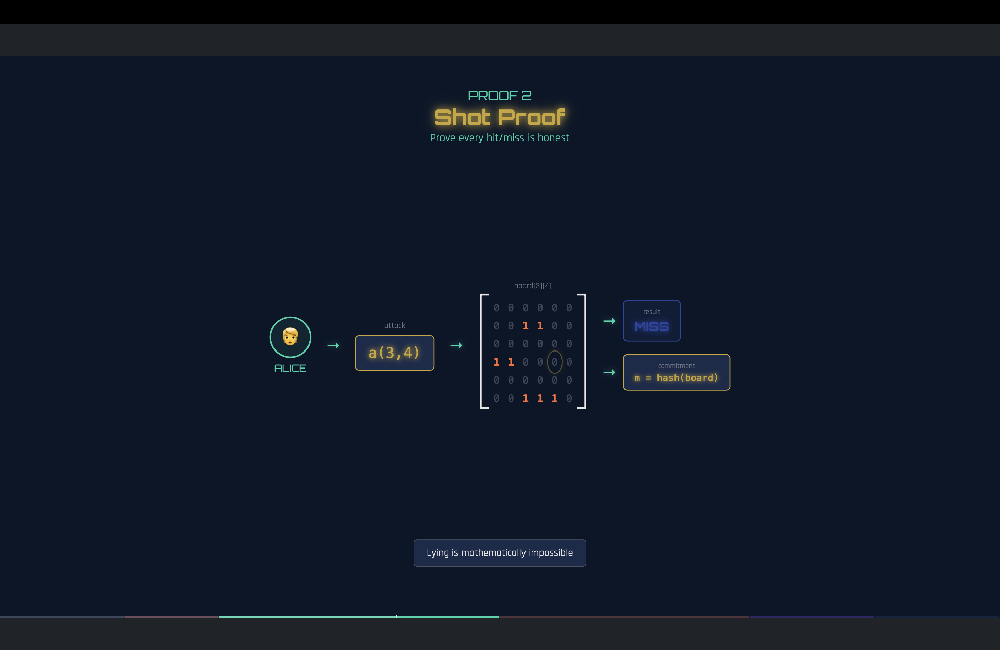
</p>

### Proof 3 — Turns Proof

The full game is replayed inside the circuit to compute and prove the winner. The circuit IS the referee.

<p align="center">
  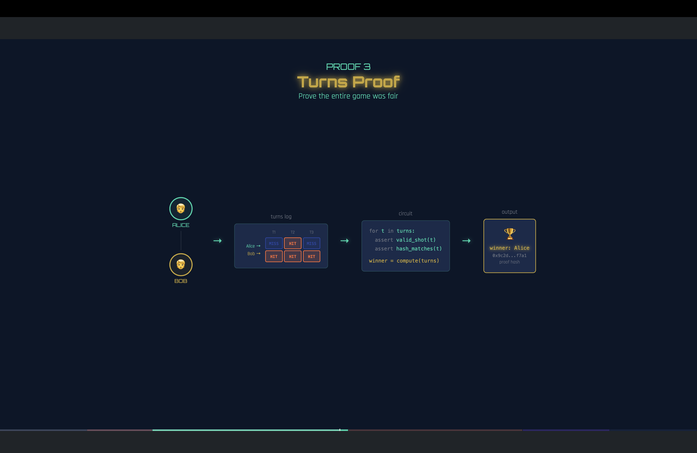
</p>

| Circuit | Trigger | What it proves | Public inputs |
|---------|---------|----------------|---------------|
| `board_validity` | Ship placement | Board is legal + Poseidon2 hash matches commitment | Board hash |
| `shot_proof` | Receive a shot | Hit/miss result is honest against committed board | Board hash, shot coords, result |
| `turns_proof` | Game ends | Full game replay inside circuit, winner computed deterministically | Both board hashes, all moves, winner |

- **Framework:** Noir 1.0.0-beta.18 (Aztec)
- **Proof system:** UltraHonk
- **Hash function:** Poseidon2 (Stellar-native)
- **Proof generation:** Client-side via NoirJS + bb.js (WASM)

> **Players never see each other's boards. The math guarantees fairness.**

---

## Architecture

Hybrid on-chain / off-chain — only 2 Soroban transactions per game.

<p align="center">
  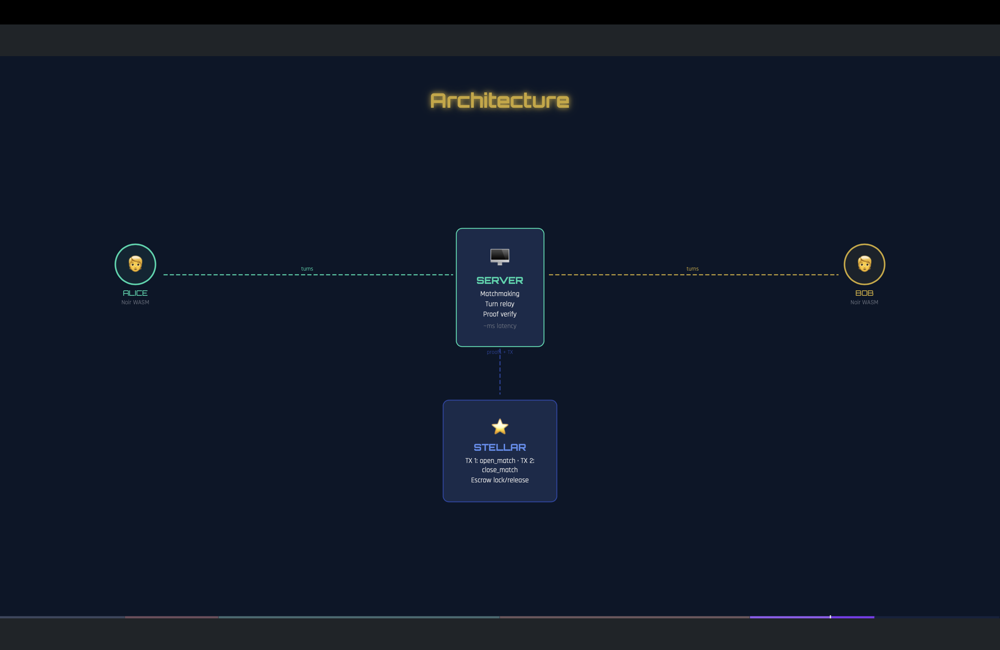
</p>

---

## Deployed on Stellar Testnet

All contracts and wallets are live and verifiable on Stellar Testnet:

| Resource | Address | Explorer |
|----------|---------|----------|
| **Battleship Verifier Contract** | `CDL6EX734XCDSTOQE5W3FYD5ZKOHQOIBXZOL4NF5FC66CEHRPIQRHMR3` | [View on Stellar Expert](https://stellar.expert/explorer/testnet/contract/CDL6EX734XCDSTOQE5W3FYD5ZKOHQOIBXZOL4NF5FC66CEHRPIQRHMR3) |
| **Game Hub Contract** | `CB4VZAT2U3UC6XFK3N23SKRF2NDCMP3QHJYMCHHFMZO7MRQO6DQ2EMYG` | [View on Stellar Expert](https://stellar.expert/explorer/testnet/contract/CB4VZAT2U3UC6XFK3N23SKRF2NDCMP3QHJYMCHHFMZO7MRQO6DQ2EMYG) |
| **Backend Wallet** (124 operations) | `GDANLGAOCSGXHMSO4PM2L43FB27MB7JBDXKSBV5CMCCEFXE3ISDEM4Z2` | [View on Stellar Expert](https://stellar.expert/explorer/testnet/account/GDANLGAOCSGXHMSO4PM2L43FB27MB7JBDXKSBV5CMCCEFXE3ISDEM4Z2) |

**Key transactions:**
- [Contract WASM Upload](https://stellar.expert/explorer/testnet/tx/5048454883590145) — UltraHonk verifier bytecode
- [Contract Deploy (`__constructor`)](https://stellar.expert/explorer/testnet/tx/294164c1a5fe5d0dd7ef7684a440743d2afa433e8c48d1007859e90706b2b481) — initialized with admin, Game Hub address, and both verification keys

The Soroban contract ([`soroban/contracts/battleship`](soroban/contracts/battleship/src/lib.rs)) verifies ZK proofs on-chain and integrates with the Game Hub:

| Action | What happens on-chain |
|--------|----------------------|
| Match start | `open_match()` verifies both players' `board_validity` proofs, then calls **`start_game()`** on the Game Hub |
| Match end | `close_match()` verifies the `turns_proof`, then calls **`end_game()`** on the Game Hub with the verified winner |

This is possible thanks to **Protocol 25 (X-Ray)** which provides native BN254 elliptic-curve operations and Poseidon2 hashing at the protocol level.

---

## Screenshots

<table>
  <tr>
    <td align="center">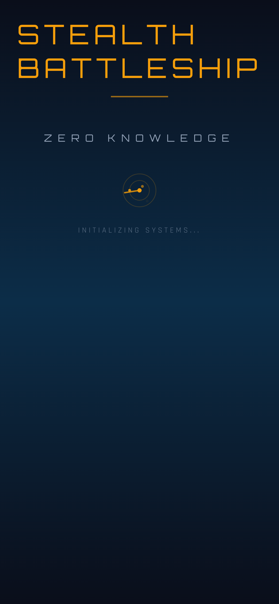<br/><sub>Splash</sub></td>
    <td align="center">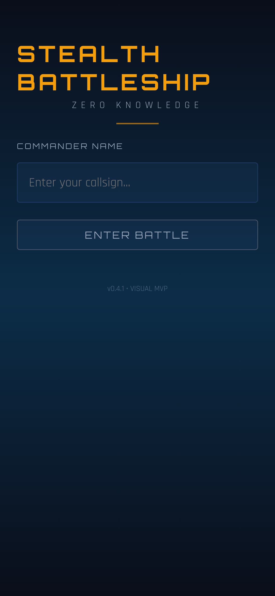<br/><sub>Login</sub></td>
    <td align="center">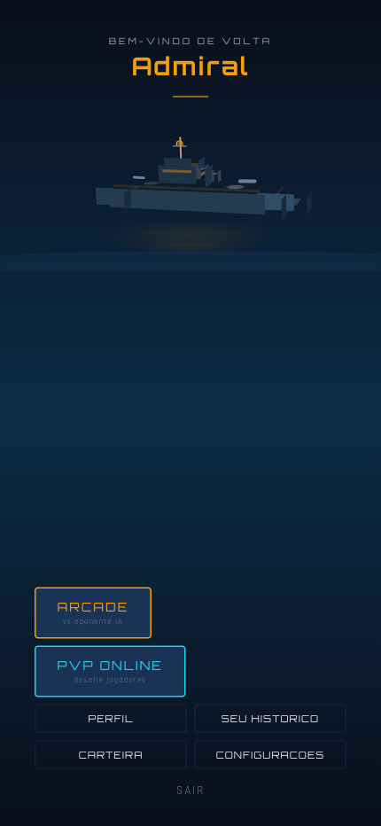<br/><sub>Menu</sub></td>
    <td align="center">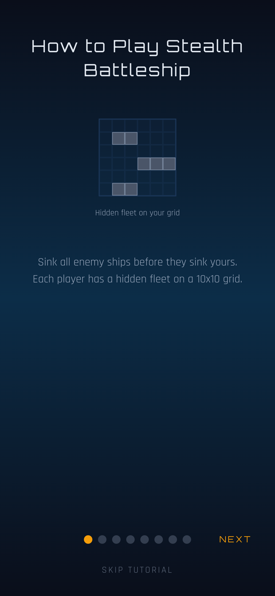<br/><sub>Tutorial</sub></td>
  </tr>
  <tr>
    <td align="center"><br/><sub>Ship Placement</sub></td>
    <td align="center">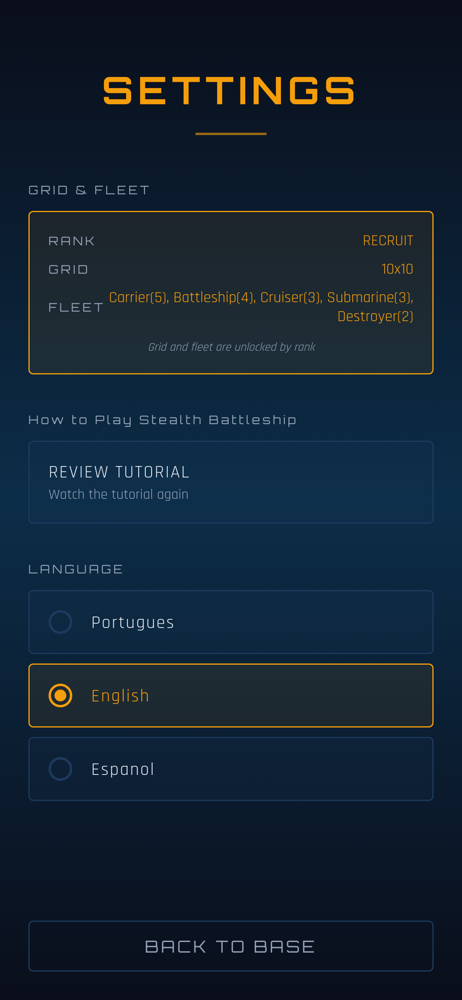<br/><sub>Settings</sub></td>
    <td align="center">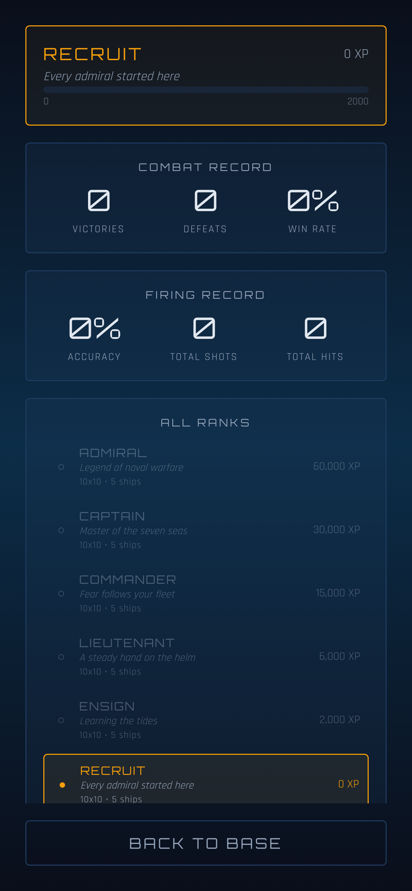<br/><sub>Profile</sub></td>
    <td align="center">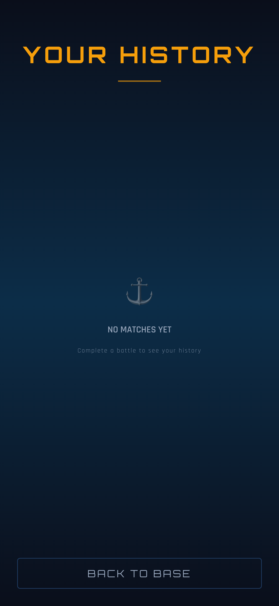<br/><sub>Match History</sub></td>
  </tr>
  <tr>
    <td align="center"><br/><sub>Match Detail</sub></td>
    <td align="center">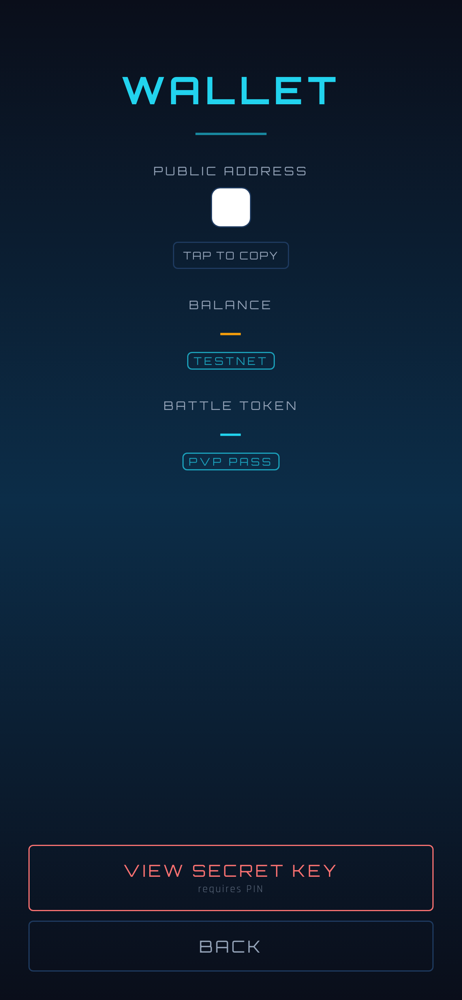<br/><sub>Wallet</sub></td>
    <td align="center">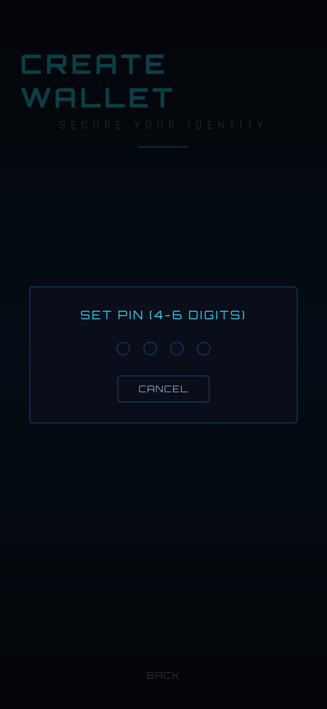<br/><sub>Wallet Setup</sub></td>
    <td align="center"><br/><sub>PvP Mode</sub></td>
  </tr>
  <tr>
    <td align="center"><br/><sub>PvP Friend</sub></td>
    <td align="center">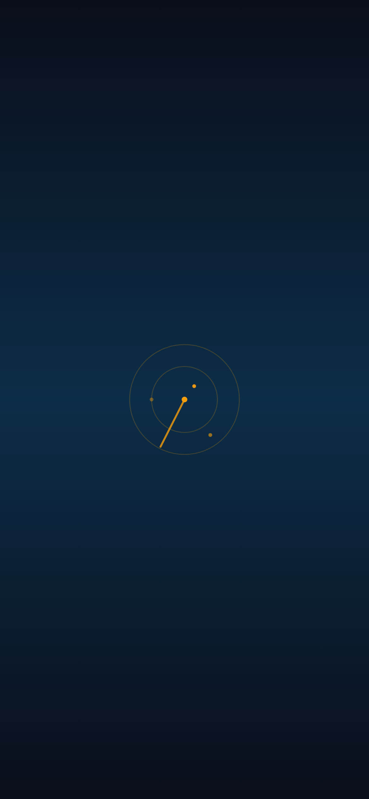<br/><sub>PvP Lobby</sub></td>
  </tr>
</table>

---

## Tech Stack

| Layer | Technology |
|-------|-----------|
| ZK Framework | Noir (Aztec) + UltraHonk |
| Hashing | Poseidon2 (Stellar-native via Protocol 25) |
| Proof Generation | NoirJS + bb.js (client-side WASM) |
| Blockchain | Stellar / Soroban (Protocol 25 X-Ray) |
| On-chain Verifier | `ultrahonk_soroban_verifier` crate |
| Backend | Express + Socket.io (real-time PvP) |
| Persistence | Supabase |
| Mobile App | React Native / Expo |
| Languages | TypeScript, Rust, Noir |

---

## Project Structure

```
stealth-battleship/
├── circuits/        # Noir ZK circuits (board_validity, shot_proof, turns_proof)
├── soroban/         # Soroban smart contract (on-chain ZK verification + Game Hub)
├── backend/         # Express + Socket.io server (matchmaking, proof relay)
├── mobile/          # React Native / Expo app
├── web/             # Web client for PvP
├── pitch/           # Presentation slides + video trailer
└── docs/            # Architecture & design docs
```

---

## How to Run

```bash
# 1. Compile ZK circuits
cd circuits && ./compile.sh

# 2. Deploy Soroban contract
cd soroban && ./deploy.sh

# 3. Start backend
cd backend && npm install && npm run dev

# 4. Start mobile app
cd mobile && npx expo start
```

---

## License

MIT

---

<p align="center">
  <a href="https://github.com/olivmath/stealth-battleship">github.com/olivmath/stealth-battleship</a>
</p>
