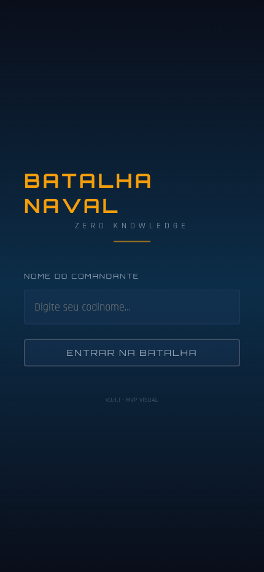
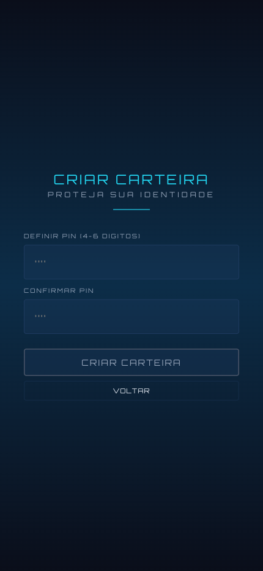
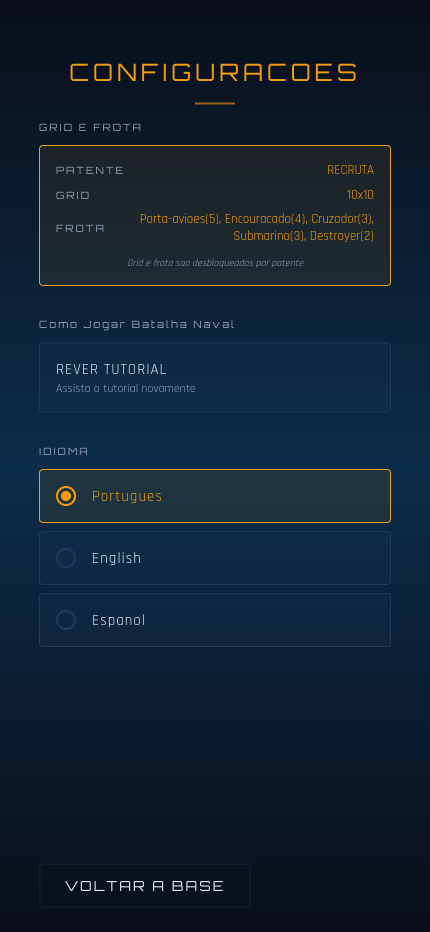
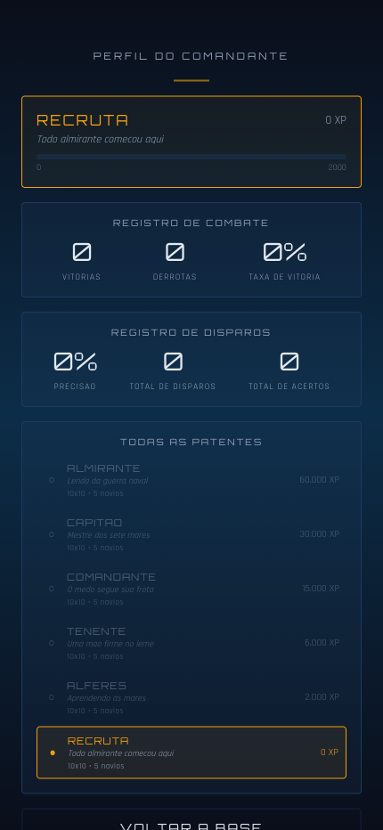
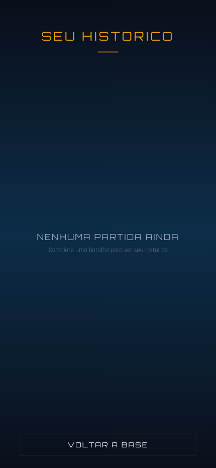
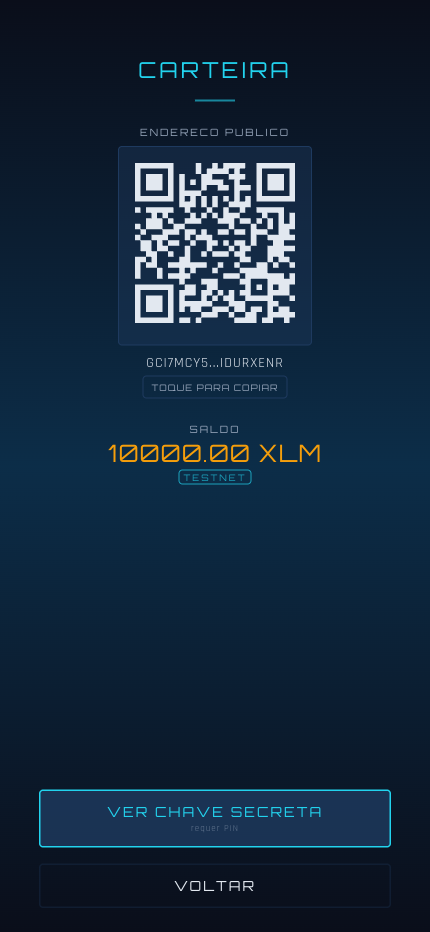
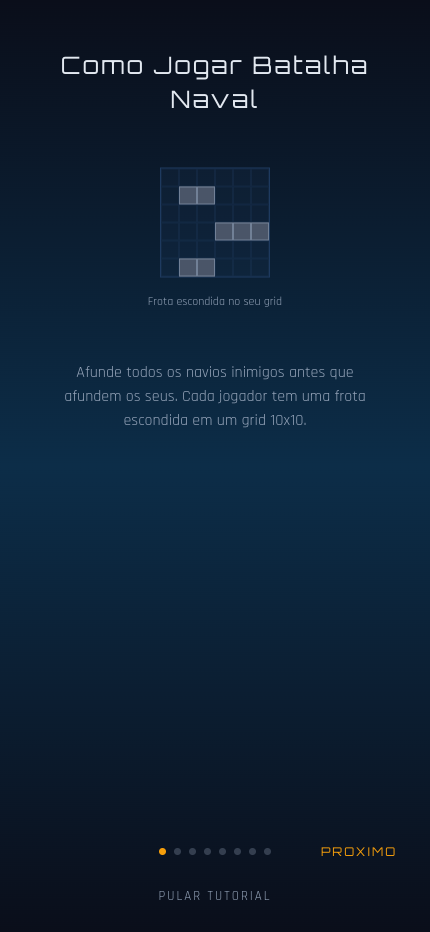
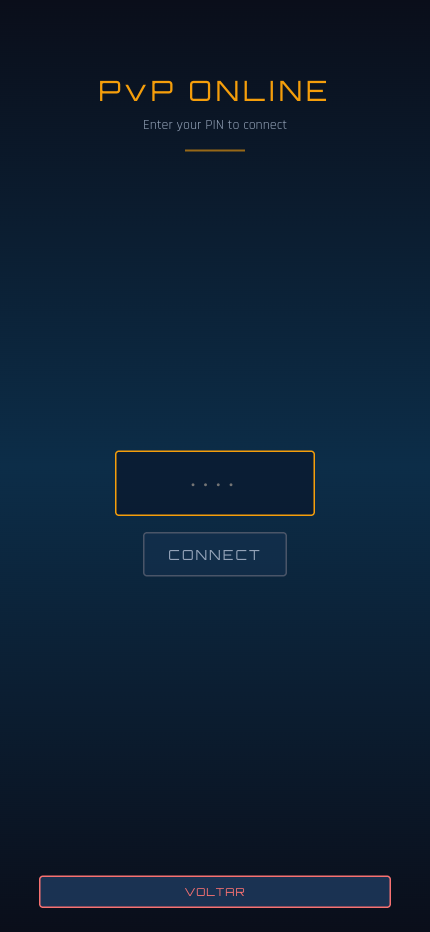
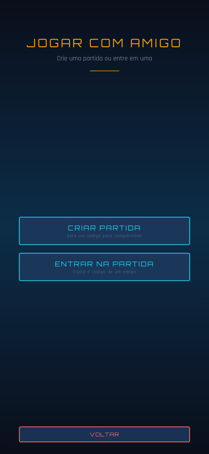
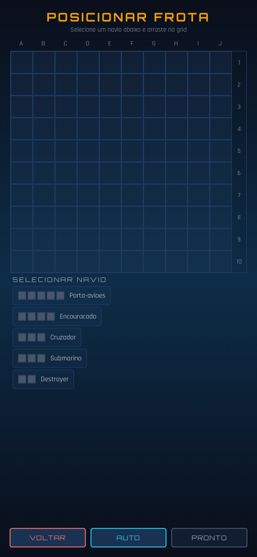

<p align="center">
  
</p>

<h1 align="center">STEALTH BATTLESHIP</h1>

<p align="center"><strong>Trustless Naval Warfare on Stellar</strong></p>

<p align="center">
  <em>Fair by math. Fun by design.</em>
</p>

---

Command your fleet in the ultimate game of deception — where **no one can cheat, not even the server**. Stealth Battleship reinvents the classic naval warfare game using Zero-Knowledge proofs powered by Noir circuits. Every ship placement is cryptographically committed, every shot is mathematically proven, and every match result is verified on the Stellar blockchain. No board reveals, no trusted third parties, no way to lie. Just pure strategy, real-time PvP, and provably fair gameplay — all from your phone. Three specialized ZK circuits guard the entire game lifecycle: your board stays private, your hits are honest, and the winner is computed inside the circuit itself. This isn't a game with ZK bolted on — **ZK is the game**.

---

## Demo

https://github.com/olivmath/battleship-zk/raw/main/assets/zkbb.mp4

## Screenshots

<table>
  <tr>
    <td align="center"><br/><sub>Login</sub></td>
    <td align="center"><br/><sub>Wallet Setup</sub></td>
    <td align="center"><br/><sub>Menu</sub></td>
    <td align="center"><br/><sub>Settings</sub></td>
  </tr>
  <tr>
    <td align="center"><br/><sub>Profile</sub></td>
    <td align="center"><br/><sub>Match History</sub></td>
    <td align="center"><br/><sub>Wallet</sub></td>
    <td align="center"><br/><sub>Tutorial</sub></td>
  </tr>
  <tr>
    <td align="center"><br/><sub>PvP Mode</sub></td>
    <td align="center"><br/><sub>PvP Lobby</sub></td>
    <td align="center"><br/><sub>PvP Friend</sub></td>
    <td align="center"><br/><sub>Ship Placement</sub></td>
  </tr>
</table>

## Tech Stack

| Layer | Technology |
|-------|-----------|
| ZK Framework | Noir (Aztec) + UltraHonk |
| Hashing | Poseidon2 |
| Proof Generation | NoirJS + bb.js (client-side WASM) |
| Blockchain | Stellar / Soroban (Protocol 25 X-Ray) |
| Backend | Express + Socket.io |
| Persistence | Supabase |
| Frontend | React Native / Expo (mobile) + React (web) |
| Languages | TypeScript, Rust, Noir |

## Project Structure

```
battleship-zk/
├── mobile/          # React Native / Expo app
├── web/             # Web client for PvP
├── backend/         # Express + Socket.io server
├── circuits/        # Noir ZK circuits
├── pitch/           # Presentation slides + video trailer
└── docs/            # Architecture & design docs
```

## Circuits

| Circuit | Trigger | What it proves |
|---------|---------|---------------|
| `board_validity` | Ship placement | Board is legal + Poseidon hash matches |
| `shot_proof` | Receive a shot | Hit/miss result is honest against committed board |
| `turns_proof` | Game ends | Full game replayed in circuit, winner computed inside |

## License

MIT

---

<p align="center">
  Built for <strong>Stellar Hacks: ZK Gaming 2026</strong><br/>
  <a href="https://github.com/olivmath/battleship-zk">github.com/olivmath/battleship-zk</a>
</p>
