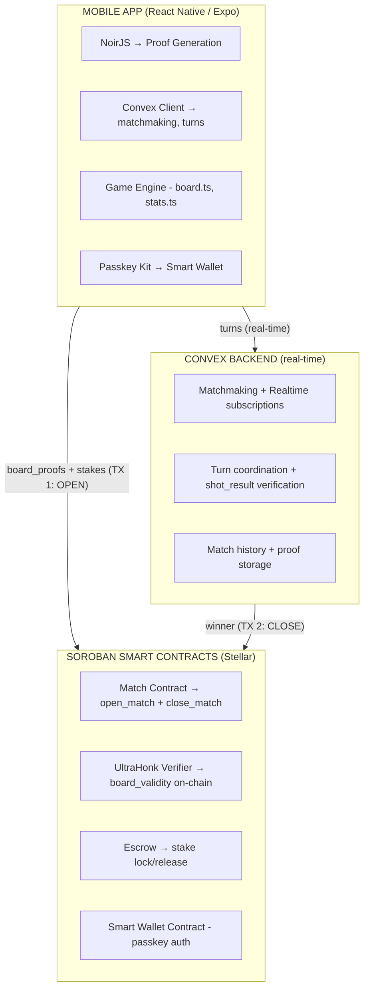
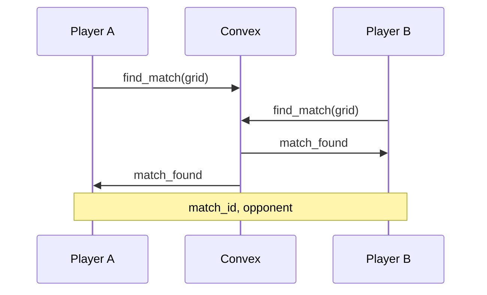

# ZK PvP — System Design

## Overview

PvP mode with zero-knowledge proofs for trustless gameplay. No board reveal needed — every move is cryptographically proven in real-time.

**Key Principle:** Prove-as-you-go, not commit-reveal.

## Architecture



### Hybrid Model

```
ON-CHAIN (Soroban):  create_match (board proofs + escrow)  →  settle_match (winner + release)
OFF-CHAIN (Convex):  matchmaking → turns → shot proofs → game logic (real-time, ~ms latency)
```

- **Inicio:** board_validity proof verificada on-chain + stake depositado em escrow
- **Turnos:** shot_result proofs verificadas off-chain no Convex (rapido)
- **Fim:** Convex submete settlement tx → Soroban libera escrow pro winner
- **Total on-chain:** 2 transacoes por jogo (open + close)

## Decisions

| Decision | Choice | Rationale |
|----------|--------|-----------|
| ZK Framework | Noir (Aztec) | Rust-like syntax, UltraHonk backend, BattleZips reference impl |
| Hashing | Poseidon | ZK-friendly, native on Stellar P25, replaces SHA-256 |
| Circuits | 2: `board_validity` + `shot_result` | Minimal set for trustless battleship |
| Proof Generation | Client-side (NoirJS) | Private inputs never leave device |
| Verification: board_validity | On-chain (Soroban UltraHonk) | Trustless, verified in TX 1 (open) |
| Verification: shot_result | Off-chain (Convex) | Real-time latency, ~ms per turn |
| On-chain txs | 2 per game: open + close | Minimal gas, maximal trust |
| Backend | Convex (realtime + edge functions) | TypeScript, realtime built-in, typed schema |
| Board Reveal | Eliminated | ZK proofs replace commit-reveal entirely |
| Model | Hybrid (on-chain + off-chain) | open/close on-chain, turns off-chain |

## Noir Circuits

### Circuit 1: `board_validity`

Proves that a player's ship placement is valid without revealing positions.

```
board_validity {
  Private inputs:
    - ship_positions: [(row, col, size, orientation)]  // array of ships
    - nonce: Field                                      // random blinding factor

  Public inputs:
    - board_hash: Field       // Poseidon(board + nonce)
    - grid_size: u8           // 6, 8, or 10
    - ship_count: u8          // number of ships expected
    - ship_sizes: [u8]        // expected sizes per rank config

  Constraints:
    - Each ship fits within grid bounds (row + size <= grid_size if vertical, etc.)
    - No two ships overlap (no shared cells)
    - Ship sizes match expected configuration for this rank/grid
    - Ship count matches expected count
    - board_hash == Poseidon(serialize(ship_positions) || nonce)
}
```

### Circuit 2: `shot_result`

Proves that a hit/miss declaration is honest against the committed board.

```
shot_result {
  Private inputs:
    - ship_positions: [(row, col, size, orientation)]  // same as placement
    - nonce: Field                                      // same nonce

  Public inputs:
    - board_hash: Field       // must match committed hash
    - shot_row: u8
    - shot_col: u8
    - is_hit: bool            // true = hit, false = miss
    - sunk_ship_id: u8        // 0 = not sunk, >0 = which ship sunk
    - hit_counts: [u8]        // current hit count per ship (for sunk verification)

  Constraints:
    - board_hash == Poseidon(serialize(ship_positions) || nonce)
    - cell_occupied = any ship covers (shot_row, shot_col)
    - is_hit == cell_occupied
    - if sunk_ship_id > 0:
        - ship[sunk_ship_id].size == hit_counts[sunk_ship_id] + 1
        - (shot_row, shot_col) is on ship[sunk_ship_id]
    - if sunk_ship_id == 0 and is_hit:
        - the hit ship is NOT fully hit yet
}
```

---

## Sequence Diagrams

### Phase 1: Matchmaking



### Phase 2: Placement + Board Commitment + Escrow (On-Chain)

```mermaid
sequenceDiagram
    participant A as Player A
    participant S as Soroban
    participant C as Convex
    participant B as Player B

    Note over A: Places ships on grid
    Note over B: Places ships on grid

    rect rgb(40, 40, 80)
        Note over A: NOIR: board_validity<br/>Private: ship_positions, nonce<br/>Public: board_hash, grid_size<br/>~2-5s "Securing your fleet..."
    end

    rect rgb(40, 40, 80)
        Note over B: NOIR: board_validity<br/>Private: ship_positions, nonce<br/>Public: board_hash, grid_size<br/>~2-5s "Securing your fleet..."
    end

    A->>C: find_match(grid_size)
    B->>C: find_match(grid_size)
    C->>A: matched(opponent: B)
    C->>B: matched(opponent: A)

    Note over A,B: Both players send proofs + stakes in 1 atomic tx

    A->>S: open_match(board_hash_a, proof_a, board_hash_b, proof_b, stake_a, stake_b)
    Note over S: TX 1 (OPEN):<br/>UltraHonk verify both proofs ✓<br/>Lock both stakes in escrow

    S->>C: match_opened(match_id, board_hash_a, board_hash_b)
    C->>A: battle_start (first_turn: random)
    C->>B: battle_start (first_turn: random)
```



### Phase 3: Battle (Turn Loop)

```mermaid
sequenceDiagram
    participant A as Attacker (A)
    participant C as Convex
    participant B as Defender (B)

    A->>C: submit_attack(match_id, row, col)
    C->>B: attack_incoming(row, col)

    Note over B: Checks locally: hit or miss?

    rect rgb(40, 40, 80)
        Note over B: NOIR: shot_result<br/>Private: ship_positions, nonce<br/>Public: board_hash, shot_row,<br/>shot_col, result, ship_id<br/>Proves: board matches hash,<br/>result matches cell,<br/>if sunk: all cells hit
    end

    B->>C: submit_result(result, proof)

    rect rgb(60, 40, 40)
        Note over C: VERIFY shot_result proof<br/>If invalid → cheater → forfeit
    end

    C->>A: attack_result(row, col, hit/miss, sunk?, next_turn)
    C->>B: attack_result(row, col, hit/miss, sunk?, next_turn)

    Note over A,B: REPEAT until all ships of one player sunk
```



### Phase 4: Game Over

```mermaid
sequenceDiagram
    participant A as Player A
    participant C as Convex
    participant S as Soroban
    participant B as Player B

    rect rgb(60, 40, 40)
        Note over C: Win check: All ships of B sunk<br/>All shot_result proofs verified<br/>Turn order correct, no timeouts
    end

    C->>S: close_match(match_id, winner: A, match_proof)
    Note over S: TX 2 (CLOSE):<br/>Verify match_proof on-chain<br/>Release escrow → Player A

    S->>C: match_closed(tx_hash)
    C->>A: game_over(winner: A, stats, XP, tx_hash)
    C->>B: game_over(winner: A, stats, XP, tx_hash)

    Note over A,B: NO BOARD REVEAL NEEDED<br/>Stakes settled on-chain trustlessly
```




---

## Soroban Contract: `battleship_match`

```rust
// 2 transactions per game: OPEN + CLOSE

// TX 1: OPEN — verify both boards + lock both stakes
fn open_match(
    player_a: Address,
    player_b: Address,
    board_hash_a: Field,
    board_hash_b: Field,
    proof_a: Bytes,        // board_validity proof
    proof_b: Bytes,        // board_validity proof
    stake_a: i128,
    stake_b: i128,
) -> u64  // returns match_id

// TX 2: CLOSE — verify result + release escrow
fn close_match(
    match_id: u64,
    winner: Address,
    match_proof: Bytes,    // aggregated or final proof
) -> ()

// Storage
struct Match {
    match_id: u64,
    player_a: Address,
    player_b: Address,
    board_hash_a: Field,
    board_hash_b: Field,
    stake_total: i128,
    status: MatchStatus,   // Open | Closed
    winner: Option<Address>,
    created_at: u64,
}
```

## Convex Schema

```typescript
// convex/schema.ts — off-chain real-time coordination

matches: defineTable({
  sorobanMatchId: v.number(),       // reference to on-chain match
  gridSize: v.number(),             // 6, 8, or 10
  status: v.string(),               // "placing" | "battle" | "finished"
  player1: v.string(),
  player2: v.string(),
  player1BoardHash: v.optional(v.string()),
  player2BoardHash: v.optional(v.string()),
  currentTurn: v.optional(v.string()),
  turnNumber: v.number(),
  winner: v.optional(v.string()),
  finishReason: v.optional(v.string()),  // "victory" | "forfeit" | "timeout"
  openTx: v.optional(v.string()),        // Soroban TX 1 hash
  closeTx: v.optional(v.string()),       // Soroban TX 2 hash
  createdAt: v.number(),
}),

attacks: defineTable({
  matchId: v.id("matches"),
  turnNumber: v.number(),
  attacker: v.string(),
  row: v.number(),
  col: v.number(),
  result: v.string(),              // "hit" | "miss" | "sunk"
  shipId: v.optional(v.number()),
  proof: v.bytes(),                // shot_result ZK proof (stored for disputes)
  verified: v.boolean(),
  createdAt: v.number(),
}),
```

## Functions by Layer

### Soroban (on-chain — 2 txs per game)

| Function | Role |
|----------|------|
| `open_match(players, hashes, proofs, stakes)` | TX 1: Verify both board_validity proofs, lock both stakes in escrow |
| `close_match(match_id, winner, match_proof)` | TX 2: Verify result, release escrow to winner |

### Convex (off-chain — real-time turns)

| Function | Role |
|----------|------|
| `find_match(player, grid_size)` | Matchmaking, pair players |
| `submit_placement(match_id, player, board_hash, proof)` | Collect both proofs, trigger open_match on Soroban |
| `submit_attack(match_id, player, row, col)` | Validate turn, broadcast to defender |
| `submit_result(match_id, player, result, proof)` | Verify shot_result proof off-chain, update state, check win |
| `trigger_close(match_id)` | Submit close_match tx to Soroban when game ends |
| `forfeit(match_id, player)` | Player quits → trigger close with opponent as winner |
| `get_match_state(match_id)` | Reconnection sync |

## UX Impact

| Moment | User Sees | What Happens Behind |
|--------|-----------|-------------------|
| Tap "Ready" after placing ships | "Securing your fleet..." + RadarSpinner | NoirJS generates board_validity proof (~2-5s) |
| Proof generated | "Deploying to blockchain..." | Soroban tx: verify proof + lock escrow (~5s) |
| Both players ready | "Battle stations!" | Convex starts real-time turn coordination |
| Opponent attacks your board | Cell flashes, hit/miss animation | NoirJS generates shot_result proof (~1-2s) |
| Game over | Stats + XP + "Settling..." | Convex → Soroban settlement tx → escrow released |
| Victory settled | "You won X XLM!" + tx link | On-chain settlement confirmed |
| Proof fails | "Opponent disconnected" (graceful) | Convex detects invalid proof → auto-settlement |

## Proof Generation Performance

- **board_validity**: ~2-5s (one time, at placement)
- **shot_result**: ~1-2s (every turn, can overlap with animations)
- **Risk**: NoirJS WASM on React Native — needs PoC spike
- **Fallback**: WebView-based proof generation if RN WASM is too slow

## Implementation Order

### Phase 1: Noir Circuits
1. Set up Noir project with Nargo
2. Implement `board_validity` circuit
3. Implement `shot_result` circuit
4. Write circuit tests with Nargo test
5. Compile to ACIR, generate TypeScript artifacts

### Phase 2: NoirJS Integration (Mobile PoC)
1. PoC: NoirJS proof generation in React Native (native bindings)
2. If native fails: WebView fallback approach
3. Migrate hashing from SHA-256 to Poseidon
4. Integrate proof generation into placement flow
5. Integrate proof generation into battle flow

### Phase 3: Soroban Contracts
1. Implement `battleship_match` contract (open_match + close_match)
2. Integrate UltraHonk Verifier for board_validity verification
3. Implement escrow logic (lock on open, release on close)
4. Deploy to Stellar testnet

### Phase 4: Convex Backend (Real-Time)
1. Set up Convex project + schema
2. Implement matchmaking + placement collection
3. Trigger open_match tx on Soroban when both players ready
4. Implement battle loop with off-chain shot_result verification
5. Trigger close_match tx on Soroban when game ends
6. Implement disconnection/timeout handling + auto-forfeit

### Phase 5: Frontend PvP
1. Unify battle screens (arcade + pvp mode flag)
2. Smart wallet integration (passkey-kit)
3. Connect to Convex realtime subscriptions
4. Add "Securing fleet" + "Deploying to blockchain" loading states
5. Add opponent status + turn timer
6. Settlement confirmation + tx link on game over
7. Handle reconnection + timeouts

## References

- [BattleZips-Noir](https://github.com/BattleZips/BattleZips-Noir) — ZK Battleship reference implementation
- [Noir Documentation](https://noir-lang.org/docs/)
- [NoirJS Guide](https://noir-lang.org/docs/tutorials/noirjs_app)
- [UltraHonk Soroban Verifier](https://github.com/indextree/ultrahonk_soroban_contract)
- [Stellar ZK Proofs (Protocol 25)](https://developers.stellar.org/docs/build/apps/zk)
- [Convex Documentation](https://docs.convex.dev/)
