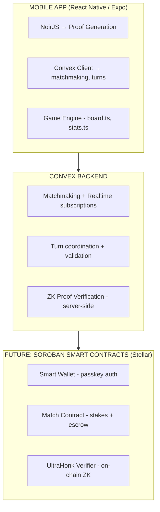
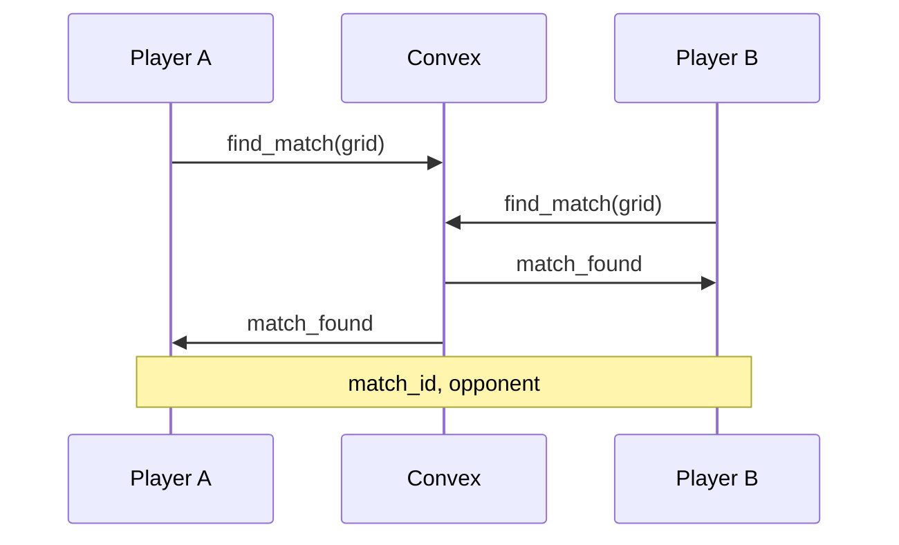

# ZK PvP — System Design

## Overview

PvP mode with zero-knowledge proofs for trustless gameplay. No board reveal needed — every move is cryptographically proven in real-time.

**Key Principle:** Prove-as-you-go, not commit-reveal.

## Architecture



## Decisions

| Decision | Choice | Rationale |
|----------|--------|-----------|
| ZK Framework | Noir (Aztec) | Rust-like syntax, UltraHonk backend, BattleZips reference impl |
| Hashing | Poseidon | ZK-friendly, native on Stellar P25, replaces SHA-256 |
| Circuits | 2: `board_validity` + `shot_result` | Minimal set for trustless battleship |
| Proof Generation | Client-side (NoirJS) | Private inputs never leave device |
| Proof Verification V1 | Server-side (Convex edge function) | Simpler, no blockchain needed |
| Proof Verification V2 | On-chain (UltraHonk Soroban contract) | Future, for stakes/on-chain settlement |
| Backend | Convex (realtime + edge functions) | TypeScript, realtime built-in, typed schema |
| Board Reveal | Eliminated | ZK proofs replace commit-reveal entirely |
| Wallet/Stakes | Not in this phase | Focus on ZK correctness first |

## Noir Circuits

### Circuit 1: `board_validity`

Proves that a player's ship placement is valid without revealing positions.

```
board_validity {
  Private inputs:
    - ship_positions: [(row, col, size, orientation)]  // array of ships
    - nonce: Field                                      // random blinding factor

  Public inputs:
    - board_hash: Field       // Poseidon(board + nonce)
    - grid_size: u8           // 6, 8, or 10
    - ship_count: u8          // number of ships expected
    - ship_sizes: [u8]        // expected sizes per rank config

  Constraints:
    - Each ship fits within grid bounds (row + size <= grid_size if vertical, etc.)
    - No two ships overlap (no shared cells)
    - Ship sizes match expected configuration for this rank/grid
    - Ship count matches expected count
    - board_hash == Poseidon(serialize(ship_positions) || nonce)
}
```

### Circuit 2: `shot_result`

Proves that a hit/miss declaration is honest against the committed board.

```
shot_result {
  Private inputs:
    - ship_positions: [(row, col, size, orientation)]  // same as placement
    - nonce: Field                                      // same nonce

  Public inputs:
    - board_hash: Field       // must match committed hash
    - shot_row: u8
    - shot_col: u8
    - is_hit: bool            // true = hit, false = miss
    - sunk_ship_id: u8        // 0 = not sunk, >0 = which ship sunk
    - hit_counts: [u8]        // current hit count per ship (for sunk verification)

  Constraints:
    - board_hash == Poseidon(serialize(ship_positions) || nonce)
    - cell_occupied = any ship covers (shot_row, shot_col)
    - is_hit == cell_occupied
    - if sunk_ship_id > 0:
        - ship[sunk_ship_id].size == hit_counts[sunk_ship_id] + 1
        - (shot_row, shot_col) is on ship[sunk_ship_id]
    - if sunk_ship_id == 0 and is_hit:
        - the hit ship is NOT fully hit yet
}
```

---

## Sequence Diagrams

### Phase 1: Matchmaking



### Phase 2: Placement + Board Commitment (ZK)

```mermaid
sequenceDiagram
    participant A as Player A
    participant C as Convex
    participant B as Player B

    Note over A: Places ships on grid
    Note over B: Places ships on grid

    Note over A: board_a = serialize(ships)<br/>nonce_a = random(32 bytes)
    Note over B: board_b = serialize(ships)<br/>nonce_b = random(32 bytes)

    rect rgb(40, 40, 80)
        Note over A: NOIR: board_validity<br/>Private: ship_positions, nonce<br/>Public: board_hash, grid_size<br/>Proves: in bounds, no overlaps,<br/>correct sizes, hash matches
    end

    rect rgb(40, 40, 80)
        Note over B: NOIR: board_validity<br/>Private: ship_positions, nonce<br/>Public: board_hash, grid_size<br/>Proves: in bounds, no overlaps,<br/>correct sizes, hash matches
    end

    A->>C: submit_placement(board_hash_a, proof_a)
    B->>C: submit_placement(board_hash_b, proof_b)

    rect rgb(60, 40, 40)
        Note over C: VERIFY both<br/>board_validity proofs
    end

    C->>A: battle_start (first_turn: random)
    C->>B: battle_start (first_turn: random)
```



### Phase 3: Battle (Turn Loop)

```mermaid
sequenceDiagram
    participant A as Attacker (A)
    participant C as Convex
    participant B as Defender (B)

    A->>C: submit_attack(match_id, row, col)
    C->>B: attack_incoming(row, col)

    Note over B: Checks locally: hit or miss?

    rect rgb(40, 40, 80)
        Note over B: NOIR: shot_result<br/>Private: ship_positions, nonce<br/>Public: board_hash, shot_row,<br/>shot_col, result, ship_id<br/>Proves: board matches hash,<br/>result matches cell,<br/>if sunk: all cells hit
    end

    B->>C: submit_result(result, proof)

    rect rgb(60, 40, 40)
        Note over C: VERIFY shot_result proof<br/>If invalid → cheater → forfeit
    end

    C->>A: attack_result(row, col, hit/miss, sunk?, next_turn)
    C->>B: attack_result(row, col, hit/miss, sunk?, next_turn)

    Note over A,B: REPEAT until all ships of one player sunk
```



### Phase 4: Game Over

```mermaid
sequenceDiagram
    participant A as Player A
    participant C as Convex
    participant B as Player B

    rect rgb(60, 40, 40)
        Note over C: Win check: All ships of B sunk<br/>Verify: All ZK proofs OK,<br/>turn order correct,<br/>no timeout violations
    end

    C->>A: game_over(winner: A, stats, XP earned)
    C->>B: game_over(winner: A, stats, XP earned)

    Note over A,B: NO BOARD REVEAL NEEDED<br/>(ZK proofs replaced it)
```



---

## Convex Schema

```typescript
// convex/schema.ts

matches: defineTable({
  gridSize: v.number(),           // 6, 8, or 10
  status: v.string(),             // "waiting" | "placing" | "battle" | "finished"
  player1: v.string(),            // player identifier
  player2: v.optional(v.string()),
  player1BoardHash: v.optional(v.string()),  // Poseidon hash
  player2BoardHash: v.optional(v.string()),
  player1BoardProof: v.optional(v.bytes()),  // board_validity proof
  player2BoardProof: v.optional(v.bytes()),
  player1Ready: v.boolean(),
  player2Ready: v.boolean(),
  currentTurn: v.optional(v.string()),       // player1 or player2
  turnNumber: v.number(),
  winner: v.optional(v.string()),
  finishReason: v.optional(v.string()),      // "victory" | "forfeit" | "cheat" | "timeout"
  createdAt: v.number(),
}),

attacks: defineTable({
  matchId: v.id("matches"),
  turnNumber: v.number(),
  attacker: v.string(),
  row: v.number(),
  col: v.number(),
  result: v.string(),              // "hit" | "miss" | "sunk"
  shipId: v.optional(v.number()),  // which ship if sunk
  proof: v.bytes(),                // shot_result ZK proof
  verified: v.boolean(),
  createdAt: v.number(),
}),
```

## Convex Edge Functions

| Function | Role |
|----------|------|
| `find_match(player, grid_size)` | Find or create match, subscribe to realtime |
| `submit_placement(match_id, player, board_hash, proof)` | Verify board_validity proof, store hash |
| `submit_attack(match_id, player, row, col)` | Validate turn, broadcast to defender |
| `submit_result(match_id, player, result, proof)` | Verify shot_result proof, update state, check win |
| `forfeit(match_id, player)` | Player quits, opponent wins |
| `get_match_state(match_id)` | Reconnection sync |

## UX Impact

| Moment | User Sees | What Happens Behind |
|--------|-----------|-------------------|
| Tap "Ready" after placing ships | "Securing your fleet..." + RadarSpinner | NoirJS generates board_validity proof (~2-5s) |
| Opponent attacks your board | Cell flashes, hit/miss animation | NoirJS generates shot_result proof (~1-2s) |
| Game over | Stats + XP screen | No board reveal — all proofs already verified |
| Proof fails | "Opponent disconnected" (graceful) | Convex detects invalid proof → forfeit cheater |

## Proof Generation Performance

- **board_validity**: ~2-5s (one time, at placement)
- **shot_result**: ~1-2s (every turn, can overlap with animations)
- **Risk**: NoirJS WASM on React Native — needs PoC spike
- **Fallback**: WebView-based proof generation if RN WASM is too slow

## Implementation Order

### Phase 1: Noir Circuits
1. Set up Noir project with Nargo
2. Implement `board_validity` circuit
3. Implement `shot_result` circuit
4. Write circuit tests with Nargo test
5. Compile to ACIR, generate TypeScript artifacts

### Phase 2: NoirJS Integration
1. PoC: NoirJS proof generation in React Native
2. If WASM fails: WebView fallback approach
3. Migrate hashing from SHA-256 to Poseidon
4. Integrate proof generation into placement flow
5. Integrate proof generation into battle flow

### Phase 3: Convex Backend
1. Set up Convex project + schema
2. Implement matchmaking (find_match)
3. Implement placement with proof verification
4. Implement battle loop with proof verification
5. Implement game over + disconnection handling

### Phase 4: Frontend PvP
1. Unify battle screens (arcade + pvp mode flag)
2. Connect to Convex realtime subscriptions
3. Add "Securing fleet" loading state
4. Add opponent status + turn timer
5. Handle reconnection + timeouts

## References

- [BattleZips-Noir](https://github.com/BattleZips/BattleZips-Noir) — ZK Battleship reference implementation
- [Noir Documentation](https://noir-lang.org/docs/)
- [NoirJS Guide](https://noir-lang.org/docs/tutorials/noirjs_app)
- [UltraHonk Soroban Verifier](https://github.com/indextree/ultrahonk_soroban_contract)
- [Stellar ZK Proofs (Protocol 25)](https://developers.stellar.org/docs/build/apps/zk)
- [Convex Documentation](https://docs.convex.dev/)
